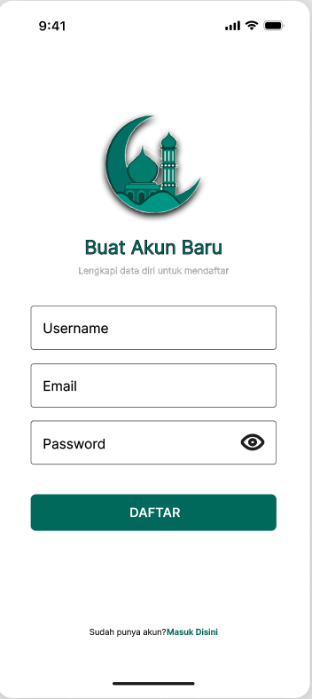
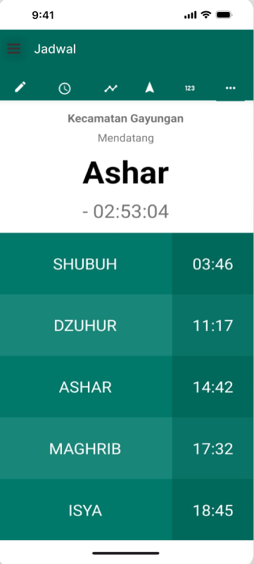
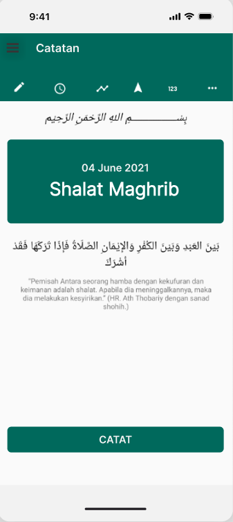
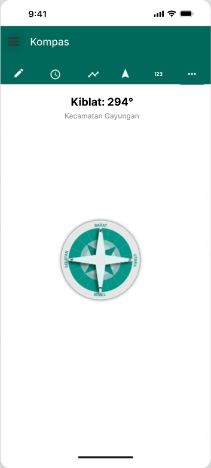
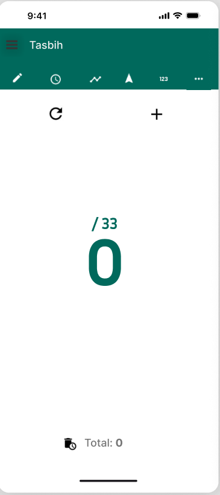
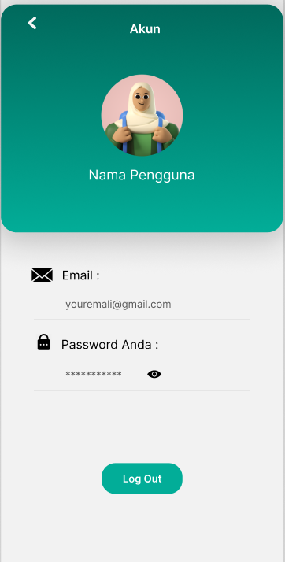

# Jago Sholat

<p align="center">
  
</p>

## Tentang Aplikasi

Jago Sholat merupakan aplikasi mobile Android yang berfungsi untuk memudahkan pengguna Muslim dalam mencatat setiap amalan sholat harian.

## Fitur

- 🔐 Login & Register User (Update)
- 📝 Pencatatan Sholat Harian
- 🕒 Jadwal Sholat Harian
- 📊 Statistik Sholat
- 📖 Panduan Tata Cara Wudhu & Sholat
- 📿 Tasbih Digital (Update)
- 🧭 Arah Kiblat (Update)
- 🔔 Notifikasi Adzan (Update)
- 👤 Halaman Profil (Update)

Catat, Lihat, dan Evaluasi semua ibadah harianmu dalam satu genggaman.

## Screenshot

### Login & Register


### Catatan Shoalt


### Jadwal Sholat


### Kompas


### Tasbih Digital


### Profil


## Teknologi

- React Native / Expo
- Kotlin
- Java
- TypeScript
- SQLite

## Download APK Here
https://drive.google.com/file/d/14cS0x5FdZRiWYad78OJCwyiq4LZAx2ki/view

## Instalasi

```bash
npm install
npm start
